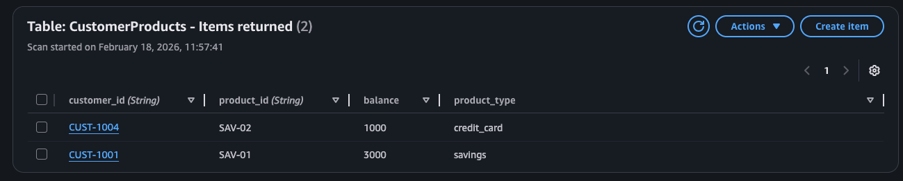
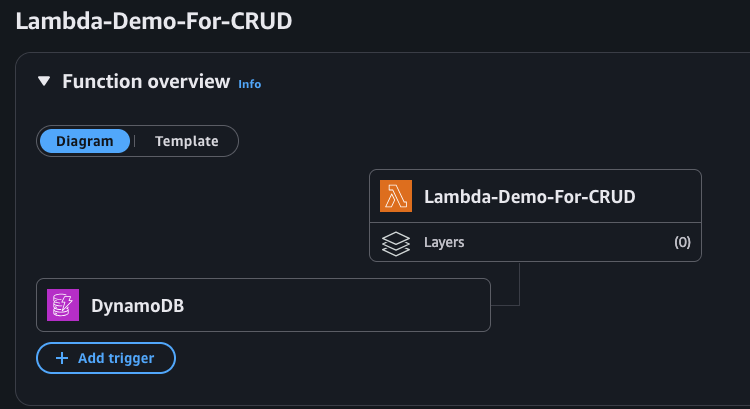
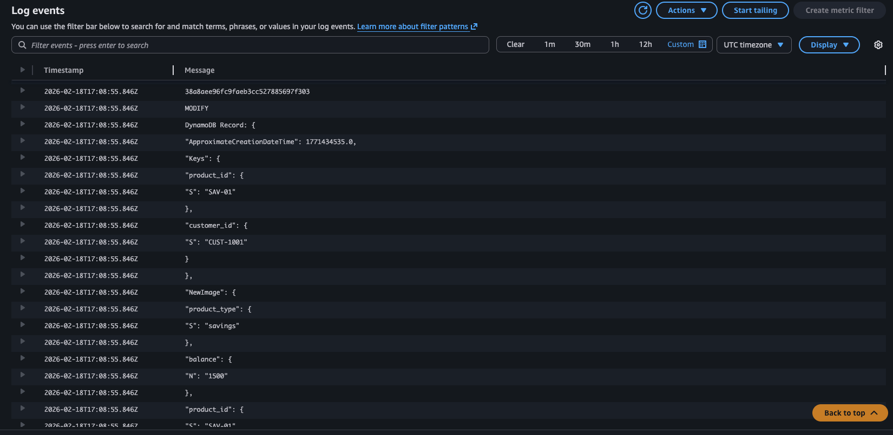

# 🚀 DynamoDB VSCode Practice  
### Python + boto3 + IAM + Streams + Lambda + CloudWatch Logs

A hands-on AWS DynamoDB project built locally using **VSCode**, **Python**, **boto3**, and **IAM credentials**.

This project demonstrates how to:

- Connect to AWS DynamoDB from a local machine
- Create a table programmatically
- Perform full CRUD operations
- Monitor changes using Lambda + CloudWatch Logs

---

## 🧠 Learning Goals

This project was created to deeply understand:

- 🔐 IAM authentication (Access Keys + Credential Provider Chain)
- 🧩 DynamoDB data modeling (Partition Key + Sort Key)
- ⚡ Query vs GetItem
- 🔄 UpdateExpression & ConditionExpression
- 🗑 Safe Delete operations
- 🐍 boto3 SDK structure (client vs resource)

---

## 🏗 Architecture

```
Local Machine (VSCode)
        │
        │ boto3 SDK
        ▼
AWS DynamoDB (Cloud)
```

Authentication:

- IAM User (programmatic access)
- Configured locally using `aws configure`
- boto3 automatically reads credentials

---

## 📂 Project Structure

```
dynamodb-vscode-practice/
│
├── create_table.py      # Creates DynamoDB table
├── app.py               # Full CRUD operations
├── requirements.txt
├── .gitignore
├── img/
│   ├── Table.png
│   ├── Lambda.png
│   └── CloudWatchLog.png
└── README.md
```

---

## 🏛 DynamoDB Table Design

**Table Name:** `CustomerProducts`

| Attribute    | Type   | Key Type                  |
|-------------|--------|---------------------------|
| customer_id | String | Partition Key (HASH)      |
| product_id  | String | Sort Key (RANGE)          |

### Example Item

```json
{
  "customer_id": "CUST-1001",
  "product_id": "SAV-01",
  "product_type": "savings",
  "balance": 1500
}
```

---

## 🔐 IAM Setup

1. Create IAM User  
2. Enable programmatic access  
3. Attach policy: `AmazonDynamoDBFullAccess` (for practice only)

Run locally:

```bash
aws configure
```

---

## 🛠 Installation

### 1️⃣ Create virtual environment

```bash
python3 -m venv venv
source venv/bin/activate
```

### 2️⃣ Install dependencies

```bash
pip install boto3
pip freeze > requirements.txt
```

---

## 🏗 Create the Table

```bash
python create_table.py
```

Wait until the table becomes **ACTIVE** in AWS Console.

---

## 🚀 Run the App (CRUD Demo)

```bash
python app.py
```

CRUD operations implemented:

- ✅ CREATE  
- ✅ READ  
- ✅ UPDATE  
- ✅ DELETE  

---

## 🐍 What is boto3?

`boto3` is the official AWS SDK for Python.

It allows Python applications to:

- Authenticate with AWS  
- Send signed API requests  
- Interact with cloud services  

Two interfaces:

- `client` → Low-level API  
- `resource` → High-level abstraction (used here)

---

## 🔒 Security Best Practices

- No hardcoded credentials  
- IAM authentication via `aws configure`  
- Uses `ConditionExpression` to prevent unintended writes  
- Principle of least privilege (recommended for production)

---

## 📸 Screenshots

### DynamoDB Table Created



---

### Lambda Trigger



---

### CloudWatch Logs



---

## 📌 License

MIT
